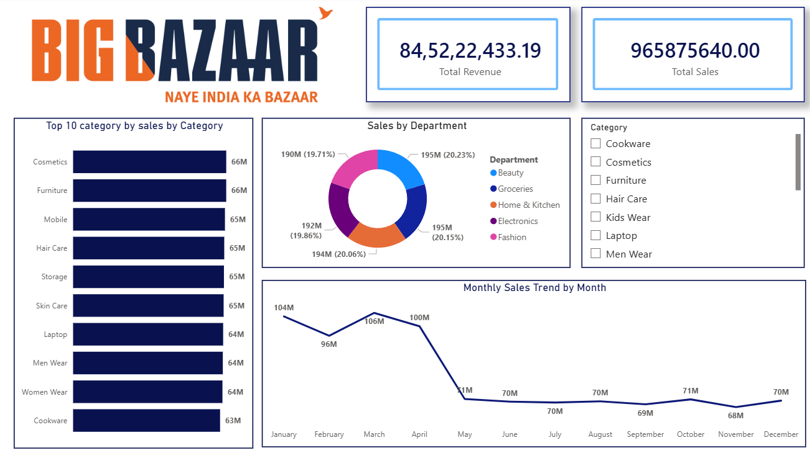

<!-- ============================================================
     BIG BAZAAR SALES DASHBOARD — README
     Author : Harshal Vora
     GitHub : HarshalVora86
     ============================================================ -->

<div align="center">

<!-- BANNER -->


<br/>


<br/>

> **A professional end-to-end Power BI Sales Dashboard for Big Bazaar — India's largest retail chain.**  
> Tracking ₹84.52 Cr in Revenue across departments, categories & months. 📈

</div>

---

## 📸 Dashboard Preview

<div align="center">



*Interactive Power BI Dashboard — Click the file to explore in Power BI Desktop*

</div>

---

## 🧭 Table of Contents

- [📌 Project Overview](#-project-overview)
- [✨ Key Highlights](#-key-highlights)
- [📊 Dashboard Features](#-dashboard-features)
- [🗂️ Data Insights](#️-data-insights)
- [🗃️ Dataset Overview](#️-dataset-overview)
- [🛠️ Tools & Technologies](#️-tools--technologies)
- [📁 Project Structure](#-project-structure)
- [🚀 How to Use](#-how-to-use)
- [👤 About Me](#-about-me)

---

## 📌 Project Overview

This project is a **fully interactive Power BI Sales Dashboard** built for **Big Bazaar** — one of India's most iconic retail chains. The dashboard gives a 360° view of sales performance, covering revenue trends, category-wise breakdowns, department-level contributions, and month-over-month performance.

Whether you're a **business analyst**, **retail manager**, or **data enthusiast**, this dashboard is designed to turn raw retail data into **actionable intelligence** — instantly.

---

## ✨ Key Highlights

| Metric | Value |
|---|---|
| 💰 Total Revenue | ₹ 84,52,22,433.19 |
| 🛍️ Total Sales Units | 96,58,75,640 |
| 🏬 Departments Tracked | 5 (Beauty, Groceries, Home & Kitchen, Electronics, Fashion) |
| 📦 Product Categories | 10+ (Cosmetics, Furniture, Mobile, Hair Care, Storage & more) |
| 📅 Time Period | Full Year — Jan to Dec |

---

## 📊 Dashboard Features

### 🔹 KPI Cards
- Instant snapshot of **Total Revenue** and **Total Sales** at the top for quick decision-making.

### 🔹 Top 10 Categories by Sales
- Horizontal bar chart ranking the **best-performing product categories**.
- Cosmetics & Furniture lead at **66M** each, followed by Mobiles and Hair Care.

### 🔹 Sales by Department (Donut Chart)
- Visual breakdown across **5 major departments** with percentage contribution.
- All departments compete closely — ranging between **19.71% to 20.23%** — indicating a well-balanced product mix.

### 🔹 Monthly Sales Trend (Line Chart)
- Full-year trend showing **seasonal peaks in Q1 (Jan–Apr)** followed by a gradual decline.
- Peak months: **March (106M)** and January/April **(104M / 100M)**.
- Helps identify **off-season strategies** and restocking opportunities.

### 🔹 Category Filter (Slicer)
- Interactive slicer to **drill down** into any specific product category.
- Enables dynamic, self-serve exploration for all stakeholders.

---

## 🗂️ Data Insights

```
📌 Highest Revenue Month  → March  (106M)
📌 Lowest Revenue Month   → November (68M)
📌 Top Department         → Beauty & Groceries (tied ~20.2%)
📌 Top Category           → Cosmetics & Furniture (66M each)
📌 Year Sales Drop        → ~35% decline from Q1 to Q2 peak-to-trough
```

> 💡 **Business Insight:** The steep drop in May suggests a post-festival slump. Targeted promotions in May–June could recover 10–15% of lost revenue.

---

## 🗃️ Dataset Overview

| Field | Details |
|---|---|
| 📁 Files | `BigBazaar_Sales.xlsx` + `BigBazaar_Sales_Dataset.csv` |
| 📝 Total Records | ~85,000 transactions |
| 📅 Date Range | 2023 – 2024 |
| 🏪 Stores | Multiple formats — Hypermarket, fbb |
| 🔑 Key Columns | Transaction_ID, Store_Name, Department, Category, Product_Name, Brand, Quantity, Unit_Price, Gross_Sales, Discount, Net_Revenue, Payment_Mode, Customer_Rating |
| 💳 Payment Modes | Cash, Credit Card, UPI |
| ⭐ Customer Rating | 1.0 – 5.0 scale |

---


## 🛠️ Tools & Technologies

<div align="center">

| Tool | Purpose |
|---|---|
|  **Power BI Desktop** | Dashboard design & visualization |
| 📐 **DAX (Data Analysis Expressions)** | Custom measures & KPIs |
| 🧹 **Power Query** | Data cleaning & transformation |
| 📊 **Excel / CSV** | Source data format |
| 🐙 **Git & GitHub** | Version control & project hosting |

</div>

---

## 📁 Project Structure

```
📦 Big_bazar_sales_dashboard/
├── 📊 day_3big_bazar_sales.pbix                  ← Power BI Dashboard File
├── 📂 BigBazaar_Sales.xlsx                       ← Cleaned Dataset (Excel)
├── 📂 BigBazaar_Sales_Dataset.csv                ← Raw Dataset (CSV · 85,000 rows)
├── 🖼️ Big_Bazaar_Sales_Dashboard_Overview.png   ← Dashboard Screenshot
└── 📄 README.md                                  ← You are here!
```

---

## 🚀 How to Use

1. **Clone the repository**
   ```bash
   git clone https://github.com/HarshalVora86/Big_bazar_sales_dashboard.git
   cd Big_bazar_sales_dashboard
   ```

2. **Open in Power BI Desktop**
   - Download [Power BI Desktop](https://powerbi.microsoft.com/desktop/) (free)
   - Open `big_bazar_sales.pbix`

3. **Explore the Dashboard**
   - Use the **Category slicer** on the right to filter visuals
   - Hover over charts for **detailed tooltips**
   - Click segments in the **donut chart** to cross-filter all visuals

---

## 👤 About Me

<div align="center">

**Harshal Vora** — Aspiring Data Analyst | Power BI Enthusiast

[](https://github.com/HarshalVora86)

*"Turning raw data into meaningful stories — one dashboard at a time."* 🚀

</div>

---

<div align="center">

⭐ **If this project helped you or impressed you, drop a star!** ⭐


</div>
